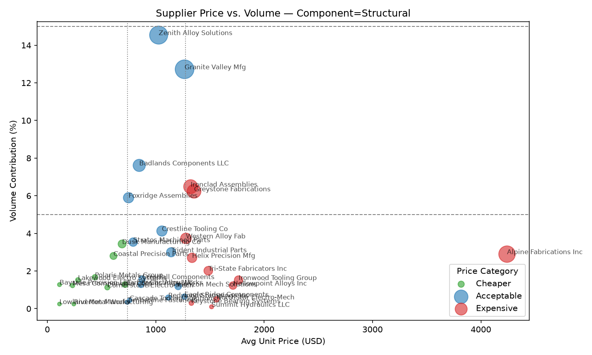
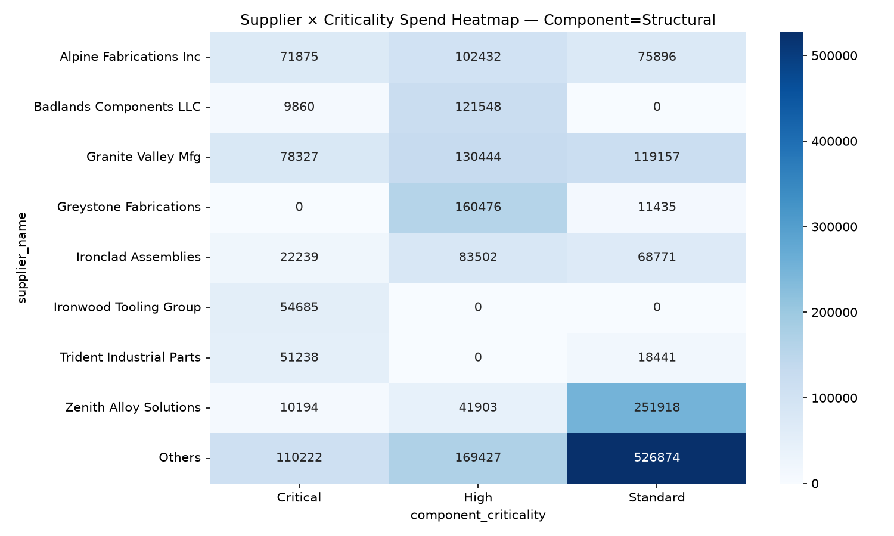
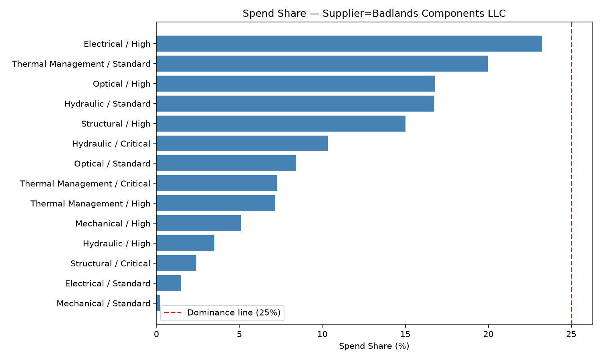

# Report 1 — Structural Category Supplier Base Rationalization

**Dataset:** `supplier-stability-dataset.csv` (517 orders, 44 suppliers, 6 component categories, 3 criticality tiers, 2024–2026)
**Output artifacts:** [`output_problem_1/`](./output_problem_1/)
**Tooling:** `procurement-analyzer` skill (12-operation scorecard/heatmap/scatter toolkit over the dataset)

---

## 1. Problem Statement

The Structural component category has **35 active suppliers** — too many relationships to manage, audit, and negotiate with efficiently. Ahead of budget planning, the goal is to rationalize this supplier base into three actionable buckets:

- **Promote** — suppliers to grow volume with
- **Renegotiate** — suppliers to keep, but fix pricing/terms/performance
- **Let go** — suppliers to exit

The complication (per the "Reduce Number of Suppliers" playbook and the known Badlands/Horizon precedent) is that a supplier who looks like a safe cut *within Structural* can turn out to be a load-bearing, even single-source, supplier in a **different** category or criticality tier. Any "let go" recommendation must therefore be checked against that supplier's **full portfolio across all six categories**, not just Structural, before it's finalized.

---

## 2. Scripts Executed and Why

| # | Script | Scope | Purpose |
|---|---|---|---|
| 1 | `price_volume_scatter.py` (op 3 — Supplier Relationship: Price vs. Volume) | `--component Structural` | Categorize each of the 35 Structural suppliers by price charged (Cheaper/Acceptable/Expensive) and volume contributed (Low/Healthy/Strategic) — first cut at who has pricing leverage and who doesn't. |
| 2 | `criticality_supplier_heatmap.py` (op 2 — Sub Category Level Supplier Division) | `--component Structural` | Identify which suppliers dominate which **criticality tier** of Structural (Strategic ≥25% / Major ≥10–25% / Smaller <10% of tier spend) — flags suppliers who look small overall but are load-bearing within Critical or High tier specifically. |
| 3 | `supplier_scorecard.py` (op 7 — Supplier Ranking and Scorecard) | `--component Structural` | Core performance scorecard per supplier: spend share, OTD%, avg days late, defect rate (supplier-fault), rework cost % of spend. This is the primary input to the Replace/Negotiate/Keep decision table. |
| 4 | `supplier_share_breakdown.py` (op 9 — Supplier Component/Criticality Share Breakdown) | `--supplier <name>`, no `--component` filter, run once per **let-go/borderline candidate** (9 suppliers) | Cross-category safety check: for every supplier flagged as a possible exit from Structural, look at their spend/qty share and delivery record across **every** category × criticality tier they touch, to catch a Badlands/Horizon-style trap before recommending exit. |

Suppliers cross-checked with operation 9: **Western Alloy Fab, Trident Industrial Parts, Dusk Manufacturing Co, Hollowpoint Alloys Inc, Horizon Mech Solutions, Crestfall Components, Riverton Manufacturing, Lowland Metal Works, Badlands Components LLC.**

---

## 3. Step-by-Step Execution and Findings

### Step 1 — Supplier Relationship: Price vs. Volume

**Command:**
```
uv run .claude/skills/procurement-analyzer/scripts/price_volume_scatter.py \
  --filepath datasets/supplier-dataset/supplier-stability-dataset.csv \
  --component Structural \
  --image-output datasets/supplier-dataset/output_problem_1/price_volume_scatter_component-Structural.png \
  --json-output datasets/supplier-dataset/output_problem_1/price_volume_scatter_component-Structural.json
```

**Output:**



**What we found:** 35 suppliers span the full price/volume matrix. Only two suppliers (Granite Valley Mfg, Zenith Alloy Solutions) land in "Acceptable / Healthy Volume" — the safest quadrant. The majority (27 of 35) are "Low Volume", meaning most of the category's spend is fragmented across small, low-leverage suppliers — exactly the tail a consolidation effort should target. A cluster of suppliers (Alpine Fabrications, Ironclad Assemblies, Greystone Fabrications, Western Alloy Fab, Helix Precision Mfg, Ironwood Tooling Group, Tri-State Fabricators, Hollowpoint Alloys, NorthStar Electro-Mech, Keystone Bearing, Summit Hydraulics) sit in "Expensive" price territory — pricing leverage targets.

**Key findings:**
- 35 distinct suppliers actively serve Structural — confirms the rationalization need.
- 27/35 are Low Volume; only 2 are in the safe "Acceptable/Healthy" quadrant.
- 11 suppliers are priced "Expensive" relative to peers — first-pass renegotiation targets.

---

### Step 2 — Sub Category Level Supplier Division (Criticality Heatmap)

**Command:**
```
uv run .claude/skills/procurement-analyzer/scripts/criticality_supplier_heatmap.py \
  --filepath datasets/supplier-dataset/supplier-stability-dataset.csv \
  --component Structural \
  --image-output datasets/supplier-dataset/output_problem_1/criticality_heatmap_component-Structural.png \
  --json-output datasets/supplier-dataset/output_problem_1/criticality_heatmap_component-Structural.json
```

**Output:**



**What we found:** No supplier reaches the "Strategic" (≥25% of a tier) threshold in Structural — spend is relatively distributed even within tiers. But 8 suppliers qualify as "Major" (≥10–25%) in at least one criticality tier:

| Supplier | Major in tier(s) | Share |
|---|---|---|
| Granite Valley Mfg | Critical / High / Standard | 19.2% / 16.1% / 11.1% |
| Alpine Fabrications Inc | Critical / High | 17.6% / 12.7% |
| Greystone Fabrications | High | 19.8% |
| Zenith Alloy Solutions | Standard | 23.5% |
| Badlands Components LLC | High | 15.0% |
| Ironclad Assemblies | High | 10.3% |
| Ironwood Tooling Group | Critical | 13.4% |
| Trident Industrial Parts | Critical | 12.5% |

**Key findings:**
- No single supplier monopolizes any Structural criticality tier (no "Strategic" flags) — the category isn't dangerously single-sourced *within itself*.
- Two suppliers (Ironwood Tooling Group, Trident Industrial Parts) are "Major" in the **Critical** tier specifically — any action against them needs extra care regardless of how they score on price/volume/performance alone.
- The remaining 27 suppliers are "Smaller" (<10% of any tier) — the real consolidation candidate pool.

---

### Step 3 — Supplier Ranking and Scorecard

**Command:**
```
uv run .claude/skills/procurement-analyzer/scripts/supplier_scorecard.py \
  --filepath datasets/supplier-dataset/supplier-stability-dataset.csv \
  --component Structural \
  --output datasets/supplier-dataset/output_problem_1/scorecard_component-Structural.json
```

**Output:** `output_problem_1/scorecard_component-Structural.json` (tabular scorecard, no chart — 35 rows: spend share, OTD%, avg days late, defect/rework metrics per supplier). `total_spend`, `volume_pct`, and `price_category`/`volume_category` below are joined in from `price_volume_scatter_component-Structural.json` and `criticality_heatmap_component-Structural.json` for a single consolidated view.

**Supplier Scoring Table (all 35 Structural suppliers, sorted by spend, ⚠️ = breaches a poor-performance threshold):**

| Supplier | Total Spend (USD) | Spend % | Volume % | Avg Unit Price (USD) | Price Category | Volume Category | OTD % | Avg Days Late | Supplier-Fault Defect % | Rework % of Spend |
|---|---|---|---|---|---|---|---|---|---|---|
| Granite Valley Mfg ⚠️ | 327,928.32 | 14.31% | 12.72% | 1,266.13 | Acceptable | Healthy Volume | 75.00% | 2.00 | 0.00% | 0.00% |
| Zenith Alloy Solutions | 304,015.71 | 13.27% | 14.54% | 1,027.08 | Acceptable | Healthy Volume | 100.00% | 0.30 | 0.00% | 0.00% |
| Alpine Fabrications Inc | 250,202.78 | 10.92% | 2.90% | 4,240.73 | Expensive | Low Volume | 100.00% | 0.80 | 0.00% | 0.00% |
| Ironclad Assemblies | 174,513.02 | 7.62% | 6.48% | 1,322.07 | Expensive | Healthy Volume | 100.00% | 0.83 | 0.00% | 0.00% |
| Greystone Fabrications ⚠️ | 171,911.18 | 7.50% | 6.24% | 1,353.63 | Expensive | Healthy Volume | 75.00% | 2.50 | 0.00% | 0.00% |
| Badlands Components LLC ⚠️ | 131,408.02 | 5.74% | 7.61% | 847.79 | Acceptable | Healthy Volume | 33.33% | 10.67 | 33.33% | 5.71% |
| Western Alloy Fab ⚠️ | 97,172.84 | 4.24% | 3.73% | 1,278.59 | Expensive | Low Volume | 100.00% | 0.00 | 100.00% | 1.31% |
| Foxridge Assemblies ⚠️ | 89,910.23 | 3.92% | 5.89% | 749.25 | Acceptable | Healthy Volume | 33.33% | 13.67 | 0.00% | 0.00% |
| Crestline Tooling Co | 88,781.76 | 3.88% | 4.13% | 1,056.93 | Acceptable | Low Volume | 100.00% | 0.00 | 0.00% | 0.00% |
| Helix Precision Mfg | 73,440.30 | 3.21% | 2.70% | 1,335.28 | Expensive | Low Volume | 100.00% | 1.00 | 0.00% | 0.00% |
| Trident Industrial Parts ⚠️ | 69,679.51 | 3.04% | 3.00% | 1,142.29 | Acceptable | Low Volume | 0.00% | 9.00 | 0.00% | 0.00% |
| Tri-State Fabricators Inc | 60,888.69 | 2.66% | 2.01% | 1,485.09 | Expensive | Low Volume | 100.00% | 1.00 | 0.00% | 0.00% |
| Stratos Machined Parts | 57,015.48 | 2.49% | 3.54% | 791.88 | Acceptable | Low Volume | 100.00% | 0.75 | 0.00% | 0.00% |
| Ironwood Tooling Group | 54,685.24 | 2.39% | 1.52% | 1,764.04 | Expensive | Low Volume | 100.00% | 0.00 | 0.00% | 0.00% |
| Dusk Manufacturing Co ⚠️ | 48,288.61 | 2.11% | 3.44% | 689.84 | Cheaper | Low Volume | 66.67% | 4.17 | 16.67% | 4.59% |
| Hollowpoint Alloys Inc ⚠️ | 42,817.39 | 1.87% | 1.23% | 1,712.70 | Expensive | Low Volume | 0.00% | 29.00 | 100.00% | 6.01% |
| Coastal Precision Parts | 34,792.23 | 1.52% | 2.80% | 610.39 | Cheaper | Low Volume | 100.00% | 0.00 | 0.00% | 0.00% |
| Horizon Mech Solutions ⚠️ | 28,974.98 | 1.26% | 1.18% | 1,207.29 | Acceptable | Low Volume | 50.00% | 3.00 | 0.00% | 0.00% |
| Crestfall Components ⚠️ | 27,966.19 | 1.22% | 1.57% | 873.94 | Acceptable | Low Volume | 66.67% | 2.67 | 66.67% | 36.62% |
| Pacific Alloy Works | 22,468.53 | 0.98% | 1.28% | 864.17 | Acceptable | Low Volume | 100.00% | 0.50 | 0.00% | 0.00% |
| Harbor Castings LLC | 18,633.68 | 0.81% | 1.28% | 716.68 | Cheaper | Low Volume | 100.00% | 0.00 | 0.00% | 0.00% |
| Eagle Ridge Components | 16,438.27 | 0.72% | 0.64% | 1,264.48 | Acceptable | Low Volume | 100.00% | 0.00 | 0.00% | 0.00% |
| NorthStar Electro-Mech | 15,603.32 | 0.68% | 0.49% | 1,560.33 | Expensive | Low Volume | 100.00% | 1.00 | 0.00% | 0.00% |
| Polaris Metals Group | 14,927.35 | 0.65% | 1.67% | 439.04 | Cheaper | Low Volume | 100.00% | 0.00 | 0.00% | 0.00% |
| Redwood Stampings Inc | 13,386.00 | 0.58% | 0.59% | 1,115.50 | Acceptable | Low Volume | 100.00% | 0.00 | 0.00% | 0.00% |
| Cornerstone Electro-Mech | 12,734.87 | 0.56% | 1.13% | 553.69 | Cheaper | Low Volume | 100.00% | 1.00 | 0.00% | 0.00% |
| Lakewood Electro Systems | 8,755.33 | 0.38% | 1.52% | 282.43 | Cheaper | Low Volume | 100.00% | 2.00 | 0.00% | 0.00% |
| Keystone Bearing Systems | 7,974.96 | 0.35% | 0.29% | 1,329.16 | Expensive | Low Volume | 100.00% | 2.00 | 0.00% | 0.00% |
| Cascade Tooling Solutions | 6,832.62 | 0.30% | 0.44% | 759.18 | Acceptable | Low Volume | 100.00% | 0.00 | 0.00% | 0.00% |
| Mesa Components Corp | 5,813.06 | 0.25% | 1.23% | 232.52 | Cheaper | Low Volume | 100.00% | 0.50 | 0.00% | 0.00% |
| Timberline Fasteners | 5,166.00 | 0.23% | 0.34% | 738.00 | Acceptable | Low Volume | 100.00% | 0.00 | 0.00% | 0.00% |
| Summit Hydraulics LLC | 3,030.78 | 0.13% | 0.10% | 1,515.39 | Expensive | Low Volume | 100.00% | 1.00 | 0.00% | 0.00% |
| Bayside Precision LLC | 2,926.56 | 0.13% | 1.28% | 112.56 | Cheaper | Low Volume | 100.00% | 0.00 | 0.00% | 0.00% |
| Riverton Manufacturing ⚠️ | 1,222.80 | 0.05% | 0.25% | 244.56 | Cheaper | Low Volume | 0.00% | 26.00 | 0.00% | 0.00% |
| Lowland Metal Works ⚠️ | 559.60 | 0.02% | 0.25% | 111.92 | Cheaper | Low Volume | 0.00% | 16.00 | 0.00% | 0.00% |

**What we found:** Applying the "poor performance" thresholds (OTD < 85%, avg days late > 5, supplier-fault defect rate > 10%, rework cost > 3% of spend):

- **12 of 35 suppliers (34%)** breach at least one poor-performance threshold.
- **3 suppliers** are "top spend concentrators" (≥10% of Structural spend): Granite Valley Mfg (14.3%), Zenith Alloy Solutions (13.3%), Alpine Fabrications Inc (10.9%).
- Worst offenders by severity: **Crestfall Components** (rework cost = 36.6% of its spend — the single largest cost bleed in the category), **Hollowpoint Alloys Inc** (0% OTD, 29 avg days late, 100% supplier-fault rate), **Trident Industrial Parts** (0% OTD, 9 avg days late), **Badlands Components LLC** (33% OTD, 10.7 avg days late, 33% supplier-fault rate).

**Key findings:**
- Roughly a third of Structural suppliers have a real performance problem — this is where the "let go" and "renegotiate" candidates come from.
- Poor performance and spend concentration rarely overlap (only Granite Valley Mfg is both) — most quality/delivery problems sit with small, low-leverage suppliers, which is favorable for exit decisions once cross-checked.

---

### Step 4 — Cross-Category Safety Check (Supplier Component/Criticality Share Breakdown)

Run once per candidate, **without** `--component`, to see their footprint across the *entire* dataset (all 6 categories × 3 criticality tiers), not just Structural.

**Command pattern:**
```
uv run .claude/skills/procurement-analyzer/scripts/supplier_share_breakdown.py \
  --filepath datasets/supplier-dataset/supplier-stability-dataset.csv \
  --supplier "<supplier name>" \
  --qty-chart-output datasets/supplier-dataset/output_problem_1/qty_share_<Supplier>.png \
  --spend-chart-output datasets/supplier-dataset/output_problem_1/spend_share_<Supplier>.png \
  --json-output datasets/supplier-dataset/output_problem_1/share_<Supplier>.json
```

Run for: Western Alloy Fab, Trident Industrial Parts, Dusk Manufacturing Co, Hollowpoint Alloys Inc, Horizon Mech Solutions, Crestfall Components, Riverton Manufacturing, Lowland Metal Works, Badlands Components LLC.

#### Finding A — Western Alloy Fab trips the trap

On Structural alone, Western Alloy Fab looks like a clean exit: Low Volume, only 4.2% of Structural spend, and a 100% supplier-fault defect rate on its single Structural PO. Its full-portfolio breakdown tells a different story:


| Category | Criticality | Spend share | Dominant? | Delayed % |
|---|---|---|---|---|
| Electrical | Critical | **28.3%** | **True** | 0% |
| Thermal Management | Critical | 21.1% | False | 0% |

Western Alloy Fab is the **dominant supplier (28.3% spend share) of Electrical/Critical components**, with a perfect delivery record there. Exiting them over one bad Structural order would have created single-source risk in a Critical-tier category — this is the exact Badlands/Horizon-style trap the check was designed to catch.

#### Finding B — Badlands Components LLC confirms why it's on the "renegotiate" list, not "replace"



| Category | Criticality | Spend share | Delayed % |
|---|---|---|---|
| Electrical | High | 23.3% | 100% |
| Thermal Management | Standard | 20.0% | 40% |
| Hydraulic | Standard | 16.7% | 75% |
| Optical | High | 16.8% | 100% |
| Structural | High | 15.0% | 50% |

None of these cross 25% (the "dominant" threshold), but Badlands is heavily embedded across four other categories, with poor delivery in most of them. This is consistent with prior findings and confirms the correct action is corrective/negotiation, never a straight exit.

#### Finding C — Trident Industrial Parts: no cross-category surprise, but a same-category one

Trident's highest share outside Structural is Mechanical/Standard at 10.1% — not a red flag. But *within* Structural, it holds 12.5% of the **Critical** tier (confirmed in Step 2) with the worst delivery record in the category (0% OTD). This is a single-category, single-tier concentration risk, not a cross-category one — still requires a phased approach (qualify a backup before exiting), just for a different reason than Western Alloy Fab.

#### Finding D — Five candidates are cross-category clean

Dusk Manufacturing Co, Hollowpoint Alloys Inc, Horizon Mech Solutions, Crestfall Components, Riverton Manufacturing, and Lowland Metal Works were all checked and **none exceed a 22% share, and none are flagged dominant, in any category/criticality combination outside Structural.** Their largest other-category positions are all minor (e.g., Horizon Mech Solutions tops out at 10.9% in Hydraulic/Critical). These are safe to exit from Structural sourcing specifically.

**Key findings from Step 4:**
- 1 of 9 checked suppliers (Western Alloy Fab) failed the cross-category safety check and was pulled back from "let go" to "renegotiate."
- 1 of 9 (Trident Industrial Parts) has a same-category (not cross-category) concentration risk requiring a phased exit.
- 1 of 9 (Badlands Components LLC) had its "renegotiate, don't replace" classification independently confirmed by its multi-category footprint.
- 6 of 9 cleared the check with no material exposure elsewhere.

---

## 4. Result: Final Rationalization

### Promote (grow volume)
| Supplier | Rationale |
|---|---|
| Zenith Alloy Solutions | 100% OTD, 0 defects, already major in Standard tier (23.5%) across 10 POs/6 quarters |
| Crestline Tooling Co | 100% OTD, 0 defects, Acceptable pricing, consistent 3-quarter track record |
| Stratos Machined Parts | 100% OTD, 0 defects, Acceptable pricing, 4 POs across 4 quarters |
| Coastal Precision Parts | 100% OTD, 0 defects, Cheaper pricing tier |
| Lakewood Electro Systems | Cheapest unit price in category, 100% OTD — pilot-expand (only 1 PO to date) |

### Renegotiate (keep, fix terms/performance)
| Supplier | Rationale |
|---|---|
| Granite Valley Mfg | OTD 75%; 14.3% spend, major across all 3 tiers |
| Badlands Components LLC | OTD 33%, 10.7 days late, 33% supplier-fault; heavily embedded in 4 other categories |
| Greystone Fabrications | OTD 75%, 2.5 days late; major in High tier (19.8%) |
| Foxridge Assemblies | OTD 33%, 13.7 days late; healthy volume contributor |
| Alpine Fabrications Inc | Most expensive supplier ($4,241/unit) but clean delivery; major in Critical (17.6%) and High (12.6%) — use leverage to negotiate price, not exit |
| **Western Alloy Fab** | Structural quality miss (100% supplier-fault on its 1 PO), **but dominant (28.3%) in Electrical/Critical elsewhere with a clean record — do not touch that relationship** |
| Trident Industrial Parts | Worst Structural delivery (0% OTD) and holds 12.5% of Structural/Critical spend — corrective action + qualify Alpine/Ironwood as backup before any exit |

### Let go (exit from Structural sourcing)
| Supplier | Rationale |
|---|---|
| Hollowpoint Alloys Inc | 0% OTD, 29 days late, 100% supplier-fault, 6.0% rework cost |
| Crestfall Components | 67% OTD, 67% supplier-fault, rework = 36.6% of spend |
| Dusk Manufacturing Co | 67% OTD, 16.7% supplier-fault, 4.6% rework cost |
| Horizon Mech Solutions | 50% OTD; largest other-category share only 10.9% — no lock-in |
| Riverton Manufacturing | 0% OTD, 26 days late; 0.05% of Structural spend — immaterial |
| Lowland Metal Works | 0% OTD, 16 days late; 0.02% of Structural spend — immaterial |

*"Let go" is scoped to Structural sourcing only — several of these suppliers (Dusk, Horizon, etc.) remain adequate suppliers in other categories and were not evaluated for exit there.*

### No action needed
The remaining 17 suppliers (Ironclad Assemblies, Helix Precision Mfg, Tri-State Fabricators, Ironwood Tooling Group, Pacific Alloy Works, Harbor Castings, Eagle Ridge Components, NorthStar Electro-Mech, Polaris Metals Group, Redwood Stampings, Cornerstone Electro-Mech, Keystone Bearing Systems, Cascade Tooling Solutions, Mesa Components Corp, Timberline Fasteners, Summit Hydraulics, Bayside Precision) are clean-performing but immaterial in spend — no urgency to act either way.

---

## 5. Conclusion

Of 35 suppliers touching Structural, the analysis converges on **5 to promote, 7 to renegotiate, 6 to let go**, and 17 requiring no action. The exercise validates the core premise of the "Reduce Number of Suppliers" playbook: a category-scoped view is not sufficient to make an exit decision safely. The cross-category check reversed one exit decision outright (Western Alloy Fab, a dominant Electrical/Critical supplier that would have been cut on a single bad Structural order) and added a caveat to a second (Trident Industrial Parts, whose risk was same-category rather than cross-category). Without Step 4, the naive "poor performance + low volume + not concentrated" filter would have produced 8 exit candidates instead of 6, one of them a genuine single-source risk.

The net effect of implementing these recommendations: consolidate spend toward 5 proven, clean, competitively-priced suppliers; keep 7 suppliers under active management (price renegotiation or corrective action) where switching cost or criticality-tier exposure makes replacement risky; and cleanly exit 6 suppliers with no offsetting risk elsewhere in the supply base.
