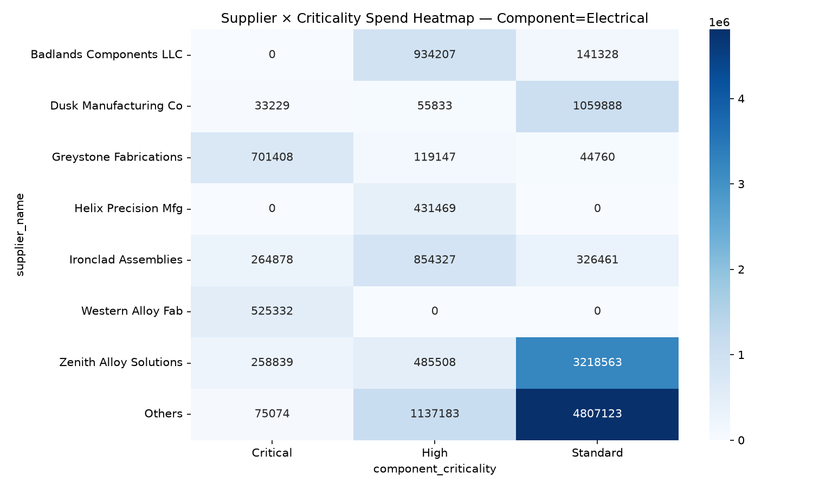
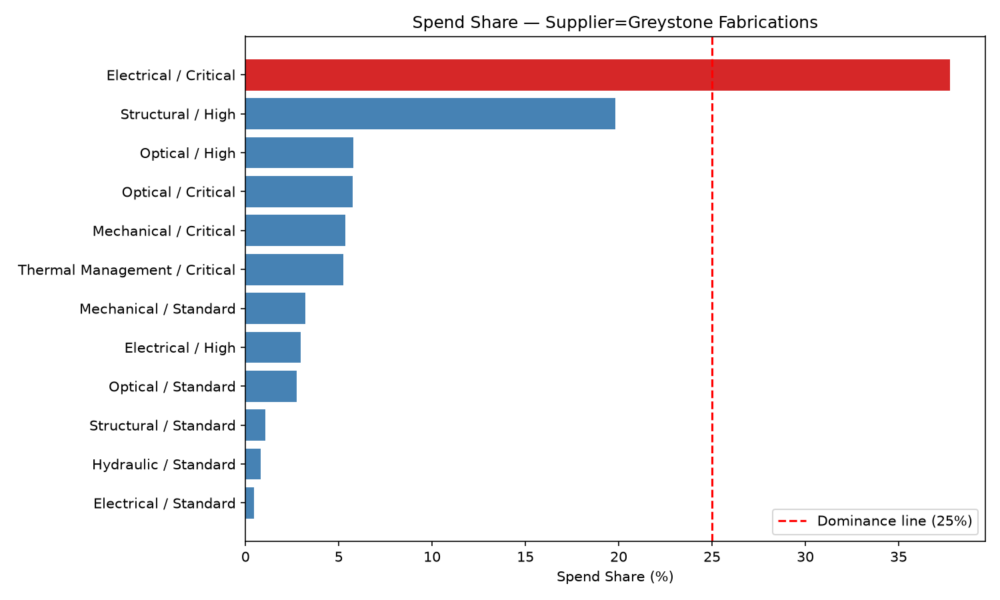
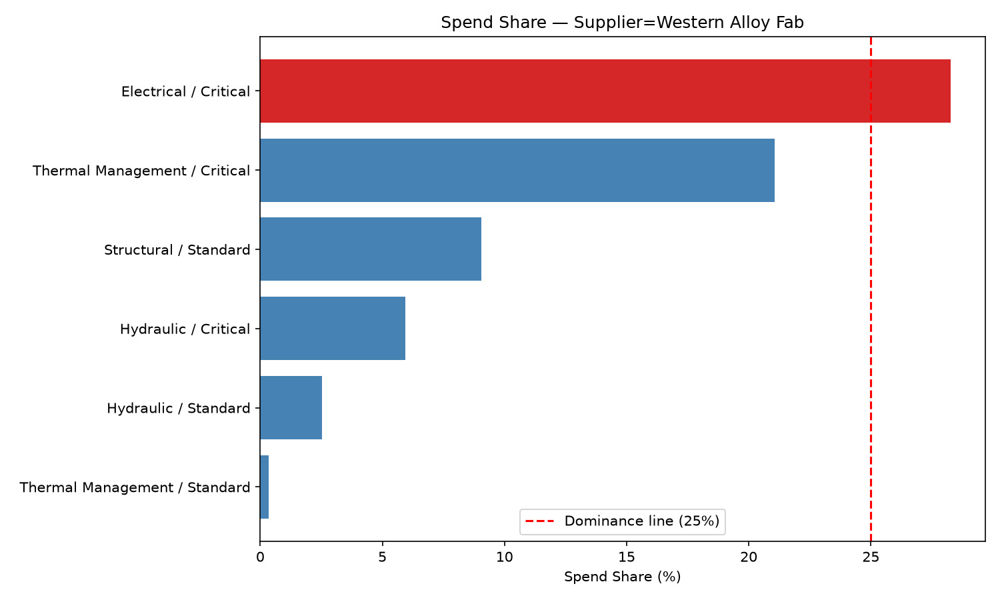

# Report 2 — Critical-Tier Single-Source Risk Audit

**Dataset:** `supplier-stability-dataset.csv` (517 orders, 44 suppliers, 6 component categories, 3 criticality tiers, 2024–2026)
**Output artifacts:** [`output_problem_2/`](./output_problem_2/)
**Tooling:** `procurement-analyzer` skill

---

## 1. Problem Statement

Before committing a new program to this supply base, is any **Critical-tier** component category exposed to a dangerous single-source (or near single-source) risk? Specifically:

1. Is any Critical-tier component category dependent on **one or two suppliers for more than 50% combined** of that tier's spend?
2. Does any **single supplier control more than 25% of more than one** Critical-tier category — **and** has poor delivery/quality performance?

Both conditions represent a program-launch risk: condition 1 flags categories where losing either of two suppliers could stall the whole category; condition 2 flags a supplier whose footprint spans multiple Critical categories *and* has a track record that makes a disruption more likely.

---

## 2. Scripts Executed and Why

| # | Script | Scope | Purpose |
|---|---|---|---|
| 1 | `criticality_supplier_heatmap.py` (op 2 — Sub Category Level Supplier Division) | `--component <category>`, run once per category (6x, all criticality tiers) | Baseline view of supplier × criticality spend distribution per category, to confirm which suppliers are "Strategic"/"Major" in the Critical tier specifically before drilling in. |
| 2 | `supplier_scorecard.py` (op 7 — Supplier Ranking and Scorecard) | `--component <category> --criticality Critical`, run once per category (6x) | The core test instrument: with `--criticality Critical` applied, `pct_spend_contribution` is recomputed against that category's Critical-tier total (not category-wide), giving exact tier-scoped spend share alongside OTD%, avg days late, supplier-fault defect rate, and rework % — everything needed for both threshold tests in one file per category. |
| 3 | `supplier_share_breakdown.py` (op 9 — Supplier Component/Criticality Share Breakdown) | `--supplier <name>`, no `--component` filter, run for every supplier flagged in Step 2 (2 suppliers) | Full cross-category/cross-tier footprint for each flagged supplier — confirms whether their concentration is isolated to one category or repeats elsewhere, and whether the dominance flag (`is_dominant_supplier`, ≥25%) trips independently of the category-scoped view. |

Categories covered: **Electrical, Hydraulic, Mechanical, Optical, Structural, Thermal Management** (all 6 in the dataset).
Suppliers cross-checked with operation 9: **Greystone Fabrications, Western Alloy Fab.**

---

## 3. Step-by-Step Execution and Findings

### Step 1 — Sub Category Level Supplier Division (baseline heatmap, per category)

**Command pattern:**
```
uv run .claude/skills/procurement-analyzer/scripts/criticality_supplier_heatmap.py \
  --filepath datasets/supplier-dataset/supplier-stability-dataset.csv \
  --component "<category>" \
  --image-output datasets/supplier-dataset/output_problem_2/criticality_heatmap_component-<category>.png \
  --json-output datasets/supplier-dataset/output_problem_2/criticality_heatmap_component-<category>.json
```
Run once for each of the 6 categories.

**Output (flagged category shown; all 6 heatmaps saved in `output_problem_2/`):**



**What we found:** Electrical is the only category where the heatmap's "Strategic" band (≥25% of a tier) is populated by more than one supplier in the same tier — both Greystone Fabrications and Western Alloy Fab qualify as Strategic in Electrical/Critical. Every other category's Critical tier tops out with a single "Major" supplier at most, no "Strategic" suppliers.

**Key findings:**
- Electrical/Critical stood out immediately at the baseline heatmap stage — confirming it needed the deeper Step 2 test.
- No other category showed two Strategic-band suppliers in the same criticality tier.

---

### Step 2 — Supplier Ranking and Scorecard, scoped to Critical tier (per category)

**Command pattern:**
```
uv run .claude/skills/procurement-analyzer/scripts/supplier_scorecard.py \
  --filepath datasets/supplier-dataset/supplier-stability-dataset.csv \
  --component "<category>" --criticality Critical \
  --output datasets/supplier-dataset/output_problem_2/scorecard_component-<category>_Critical.json
```
Run once for each of the 6 categories.

**Top-2 concentration test (condition 1) — all 6 categories:**

| Category | # Critical-tier suppliers | Top supplier | Share | 2nd supplier | Share | Combined Top-2 | >50%? |
|---|---|---|---|---|---|---|---|
| **Electrical** | 8 | Greystone Fabrications | 37.74% | Western Alloy Fab | 28.26% | **66.00%** | 🚩 **YES** |
| Thermal Management | 12 | Riverton Manufacturing | 21.14% | Western Alloy Fab | 21.06% | 42.20% | No |
| Mechanical | 12 | Ironclad Assemblies | 24.83% | Zenith Alloy Solutions | 18.65% | 43.48% | No |
| Optical | 13 | Lakewood Electro Systems | 20.94% | Riverton Manufacturing | 19.65% | 40.59% | No |
| Hydraulic | 10 | Prairie Industrial Supply | 21.42% | Keystone Bearing Systems | 18.02% | 39.44% | No |
| Structural | 18 | Granite Valley Mfg | 19.17% | Alpine Fabrications Inc | 17.59% | 36.76% | No |

**Full per-category detail (sorted by Critical-tier spend share, ⚠️ = poor performance: OTD<85%, avg days late>5, supplier-fault defect rate>10%, or rework>3% of spend):**

#### Electrical — Critical tier (8 suppliers) 🚩 flagged

| Supplier | Critical-Tier Spend Share | Avg Unit Price (USD) | OTD % | Avg Days Late | Supplier-Fault Defect % | Rework % of Spend | Poor? |
|---|---|---|---|---|---|---|---|
| Greystone Fabrications | 37.74% | 14,923.58 | 100.00% | 0.00 | 0.00% | 0.00% | |
| Western Alloy Fab | 28.26% | 12,217.03 | 100.00% | 0.00 | 0.00% | 0.00% | |
| Ironclad Assemblies | 14.25% | 9,133.74 | 100.00% | 0.00 | 0.00% | 0.00% | |
| Zenith Alloy Solutions | 13.93% | 9,955.34 | 100.00% | 0.00 | 0.00% | 0.00% | |
| Eagle Ridge Components | 2.39% | 3,695.61 | 100.00% | 0.00 | 0.00% | 0.00% | |
| Dusk Manufacturing Co | 1.79% | 3,020.84 | 0.00% | 13.00 | 100.00% | 21.10% | ⚠️ |
| Granite Valley Mfg | 1.06% | 9,897.63 | 100.00% | 0.00 | 0.00% | 0.00% | |
| Hollowpoint Alloys Inc | 0.59% | 840.88 | 100.00% | 4.00 | 100.00% | 76.09% | ⚠️ |

#### Hydraulic — Critical tier (10 suppliers)

| Supplier | Critical-Tier Spend Share | Avg Unit Price (USD) | OTD % | Avg Days Late | Supplier-Fault Defect % | Rework % of Spend | Poor? |
|---|---|---|---|---|---|---|---|
| Prairie Industrial Supply | 21.42% | 5,817.50 | 100.00% | 1.00 | 0.00% | 0.00% | |
| Keystone Bearing Systems | 18.02% | 2,681.83 | 100.00% | 0.00 | 0.00% | 0.00% | |
| Stratos Machined Parts | 17.12% | 6,199.99 | 100.00% | 0.00 | 0.00% | 0.00% | |
| Horizon Mech Solutions | 10.85% | 3,928.92 | 50.00% | 4.00 | 0.00% | 0.00% | ⚠️ |
| Badlands Components LLC | 10.32% | 3,399.35 | 50.00% | 10.00 | 0.00% | 0.00% | ⚠️ |
| Dusk Manufacturing Co | 7.51% | 2,718.30 | 66.67% | 5.00 | 0.00% | 0.00% | ⚠️ |
| Western Alloy Fab | 5.95% | 4,312.03 | 100.00% | 1.00 | 0.00% | 0.00% | |
| Alpine Fabrications Inc | 4.86% | 2,110.98 | 100.00% | 0.50 | 0.00% | 0.00% | |
| Cascade Tooling Solutions | 2.05% | 1,393.18 | 100.00% | 1.00 | 0.00% | 0.00% | |
| Coastal Precision Parts | 1.91% | 2,968.43 | 100.00% | 3.00 | 100.00% | 30.12% | ⚠️ |

#### Mechanical — Critical tier (12 suppliers)

| Supplier | Critical-Tier Spend Share | Avg Unit Price (USD) | OTD % | Avg Days Late | Supplier-Fault Defect % | Rework % of Spend | Poor? |
|---|---|---|---|---|---|---|---|
| Ironclad Assemblies | 24.83% | 2,404.21 | 100.00% | 1.33 | 0.00% | 0.00% | |
| Zenith Alloy Solutions | 18.65% | 4,355.32 | 100.00% | 1.00 | 0.00% | 0.00% | |
| Helix Precision Mfg | 14.87% | 1,735.65 | 100.00% | 2.00 | 0.00% | 0.00% | |
| Crestfall Components | 7.83% | 4,781.97 | 100.00% | 0.00 | 0.00% | 0.00% | |
| Stratos Machined Parts | 7.62% | 2,240.59 | 100.00% | 0.00 | 0.00% | 0.00% | |
| Dusk Manufacturing Co | 6.82% | 1,745.83 | 100.00% | 4.00 | 100.00% | 15.54% | ⚠️ |
| Alpine Fabrications Inc | 6.00% | 9,531.16 | 100.00% | 0.00 | 0.00% | 0.00% | |
| Greystone Fabrications | 5.36% | 3,546.42 | 100.00% | 0.00 | 100.00% | 2.94% | ⚠️ |
| Coastal Precision Parts | 4.21% | 4,176.95 | 100.00% | 1.00 | 0.00% | 0.00% | |
| Apex Precision Components | 1.90% | 3,776.26 | 100.00% | 0.00 | 0.00% | 0.00% | |
| Eagle Ridge Components | 1.41% | 1,019.89 | 100.00% | 1.00 | 0.00% | 0.00% | |
| Redwood Stampings Inc | 0.49% | 3,863.03 | 100.00% | 0.00 | 0.00% | 0.00% | |

#### Optical — Critical tier (13 suppliers)

| Supplier | Critical-Tier Spend Share | Avg Unit Price (USD) | OTD % | Avg Days Late | Supplier-Fault Defect % | Rework % of Spend | Poor? |
|---|---|---|---|---|---|---|---|
| Lakewood Electro Systems | 20.94% | 49,739.10 | 100.00% | 0.00 | 0.00% | 0.00% | |
| Riverton Manufacturing | 19.65% | 40,003.36 | 0.00% | 32.00 | 0.00% | 0.00% | ⚠️ |
| Harbor Castings LLC | 19.05% | 27,151.92 | 100.00% | 1.00 | 0.00% | 0.00% | |
| Summit Hydraulics LLC | 11.72% | 10,126.23 | 100.00% | 2.00 | 0.00% | 0.00% | |
| Lakeview Thermal Systems | 9.22% | 4,237.15 | 100.00% | 3.00 | 0.00% | 0.00% | |
| Greystone Fabrications | 5.76% | 32,835.39 | 0.00% | 18.00 | 0.00% | 0.00% | ⚠️ |
| Lowland Metal Works | 3.65% | 34,716.92 | 100.00% | 0.00 | 100.00% | 9.74% | ⚠️ |
| Crestline Tooling Co | 3.16% | 12,857.54 | 100.00% | 2.00 | 0.00% | 0.00% | |
| Vega Electronics Ltd | 3.13% | 14,871.86 | 100.00% | 2.00 | 0.00% | 0.00% | |
| Ironclad Assemblies | 1.72% | 49,051.22 | 100.00% | 0.00 | 0.00% | 0.00% | |
| Dusk Manufacturing Co | 0.81% | 1,766.30 | 100.00% | 2.00 | 0.00% | 0.00% | |
| Alpine Fabrications Inc | 0.76% | 4,342.61 | 100.00% | 0.00 | 0.00% | 0.00% | |
| Coastal Precision Parts | 0.42% | 753.72 | 100.00% | 0.00 | 0.00% | 0.00% | |

#### Structural — Critical tier (18 suppliers)

| Supplier | Critical-Tier Spend Share | Avg Unit Price (USD) | OTD % | Avg Days Late | Supplier-Fault Defect % | Rework % of Spend | Poor? |
|---|---|---|---|---|---|---|---|
| Granite Valley Mfg | 19.17% | 1,424.12 | 50.00% | 2.50 | 0.00% | 0.00% | ⚠️ |
| Alpine Fabrications Inc | 17.59% | 10,267.86 | 100.00% | 2.00 | 0.00% | 0.00% | |
| Ironwood Tooling Group | 13.38% | 1,764.04 | 100.00% | 0.00 | 0.00% | 0.00% | |
| Trident Industrial Parts | 12.54% | 1,249.71 | 0.00% | 13.00 | 0.00% | 0.00% | ⚠️ |
| Hollowpoint Alloys Inc | 6.19% | 1,580.95 | 0.00% | 31.00 | 100.00% | 2.87% | ⚠️ |
| Ironclad Assemblies | 5.44% | 1,710.71 | 100.00% | 0.00 | 0.00% | 0.00% | |
| Eagle Ridge Components | 3.84% | 1,306.71 | 100.00% | 0.00 | 0.00% | 0.00% | |
| NorthStar Electro-Mech | 3.82% | 1,560.33 | 100.00% | 1.00 | 0.00% | 0.00% | |
| Cornerstone Electro-Mech | 3.12% | 553.69 | 100.00% | 1.00 | 0.00% | 0.00% | |
| Dusk Manufacturing Co | 2.72% | 927.40 | 100.00% | 0.00 | 0.00% | 0.00% | |
| Zenith Alloy Solutions | 2.49% | 1,274.22 | 100.00% | 1.00 | 0.00% | 0.00% | |
| Badlands Components LLC | 2.41% | 136.94 | 0.00% | 21.00 | 0.00% | 0.00% | ⚠️ |
| Lakewood Electro Systems | 2.14% | 282.43 | 100.00% | 2.00 | 0.00% | 0.00% | |
| Cascade Tooling Solutions | 1.67% | 759.18 | 100.00% | 0.00 | 0.00% | 0.00% | |
| Stratos Machined Parts | 1.22% | 1,661.03 | 100.00% | 1.00 | 0.00% | 0.00% | |
| Mesa Components Corp | 1.20% | 204.25 | 100.00% | 1.00 | 0.00% | 0.00% | |
| Bayside Precision LLC | 0.72% | 112.56 | 100.00% | 0.00 | 0.00% | 0.00% | |
| Pacific Alloy Works | 0.34% | 197.04 | 100.00% | 0.00 | 0.00% | 0.00% | |

#### Thermal Management — Critical tier (12 suppliers)

| Supplier | Critical-Tier Spend Share | Avg Unit Price (USD) | OTD % | Avg Days Late | Supplier-Fault Defect % | Rework % of Spend | Poor? |
|---|---|---|---|---|---|---|---|
| Riverton Manufacturing | 21.14% | 5,708.27 | 100.00% | 2.00 | 0.00% | 0.00% | |
| Western Alloy Fab | 21.06% | 4,811.84 | 100.00% | 1.67 | 0.00% | 0.00% | |
| Timberline Fasteners | 11.62% | 5,115.57 | 100.00% | 0.00 | 0.00% | 0.00% | |
| Ironclad Assemblies | 10.50% | 2,835.52 | 100.00% | 0.50 | 0.00% | 0.00% | |
| Horizon Mech Solutions | 9.72% | 4,279.67 | 100.00% | 0.00 | 0.00% | 0.00% | |
| Badlands Components LLC | 7.26% | 2,331.66 | 0.00% | 33.00 | 50.00% | 10.53% | ⚠️ |
| Greystone Fabrications | 5.25% | 2,012.54 | 100.00% | 0.00 | 100.00% | 11.07% | ⚠️ |
| NorthStar Electro-Mech | 4.29% | 1,498.17 | 100.00% | 0.00 | 0.00% | 0.00% | |
| Zenith Alloy Solutions | 3.71% | 4,894.69 | 100.00% | 1.00 | 0.00% | 0.00% | |
| Eagle Ridge Components | 3.41% | 1,038.48 | 100.00% | 1.50 | 0.00% | 0.00% | |
| Granite Valley Mfg | 1.14% | 589.62 | 100.00% | 1.00 | 0.00% | 0.00% | |
| Crestfall Components | 0.90% | 2,141.41 | 0.00% | 20.00 | 0.00% | 0.00% | ⚠️ |

**Multi-category >25% test (condition 2) — across all 6 categories:**

| Supplier | Categories with >25% Critical-tier share | Poor performance in that category? |
|---|---|---|
| Greystone Fabrications | Electrical (37.74%) only | No — clean (100% OTD, 0% defects) |
| Western Alloy Fab | Electrical (28.26%) only | No — clean (100% OTD, 0% defects) |

No supplier crosses 25% share in **two or more** Critical categories — Western Alloy Fab comes closest, holding 21.06% in Thermal Management/Critical in addition to its 28.26% in Electrical, but that falls short of the 25% bar in the second category. **Condition 2, as strictly defined, is not triggered by any supplier.**

**Key findings:**
- Only Electrical/Critical fails the top-2 concentration test (66.00% vs. 50% threshold).
- No supplier fails the "controls >25% of 2+ Critical categories + poor performance" test as strictly defined.
- A secondary pattern worth flagging: **Greystone Fabrications** is clean in its dominant Electrical/Critical position but is a **poor performer in 3 of its 4 other Critical-tier category positions** — 100% supplier-fault defect rate in Mechanical/Critical, 0% OTD (18 days late) in Optical/Critical, and 100% supplier-fault defect rate with 11.07% rework cost in Thermal Management/Critical. None of these individually cross 25% share, so condition 2 isn't triggered, but the pattern is a risk signal worth monitoring given how load-bearing this supplier is in Electrical.

---

### Step 3 — Cross-Category Confirmation (Supplier Component/Criticality Share Breakdown)

Run for the two suppliers flagged in Step 2's concentration test, to confirm their dominance independently and see their full footprint.

**Command pattern:**
```
uv run .claude/skills/procurement-analyzer/scripts/supplier_share_breakdown.py \
  --filepath datasets/supplier-dataset/supplier-stability-dataset.csv \
  --supplier "<name>" \
  --qty-chart-output datasets/supplier-dataset/output_problem_2/qty_share_<Supplier>.png \
  --spend-chart-output datasets/supplier-dataset/output_problem_2/spend_share_<Supplier>.png \
  --json-output datasets/supplier-dataset/output_problem_2/share_<Supplier>.json
```

**Output:**




**What we found:**

| Supplier | Category / Tier | Spend Share | `is_dominant_supplier` (≥25%) | Delayed % |
|---|---|---|---|---|
| Greystone Fabrications | Electrical / Critical | 37.74% | **True** | 0% |
| Greystone Fabrications | Structural / High | 19.82% | False | 0% |
| Western Alloy Fab | Electrical / Critical | 28.26% | **True** | 0% |
| Western Alloy Fab | Thermal Management / Critical | 21.06% | False | 0% |

**Key findings:**
- The tool's own `is_dominant_supplier` flag (independent of the manual 25% test) confirms both suppliers as dominant in Electrical/Critical — no discrepancy between the manual threshold check and the tool's built-in dominance logic.
- Neither supplier shows a second dominant (≥25%) position anywhere else in the portfolio — the risk is real but currently confined to one category.
- Both have a 0% delayed rate specifically within their dominant Electrical/Critical position — the concentration risk is structural (too much of the category on two suppliers), not a performance-driven risk today.

---

## 4. Result

**Question 1 — Is any Critical-tier category dependent on one or two suppliers for >50% combined?**
**Yes.** **Electrical/Critical** is single/dual-source dependent: **Greystone Fabrications (37.74%) + Western Alloy Fab (28.26%) = 66.00%** of that tier's spend, against a 50% threshold. No other category comes close (next highest is Mechanical at 43.48%).

**Question 2 — Does any supplier control >25% of more than one Critical category and have poor performance?**
**No**, not as strictly defined. Only Greystone Fabrications (37.74%) and Western Alloy Fab (28.26%) cross the 25% mark at all, and each does so in only one category (Electrical); both are clean performers there. However, **Greystone Fabrications carries a documented poor-performance pattern in three other Critical-tier positions** (Mechanical, Optical, Thermal Management) even though none individually crosses 25% share — this is flagged as a secondary watch item rather than a hard trigger.

---

## 5. Conclusion

The audit surfaces one confirmed, quantified single-source risk — **Electrical/Critical**, where two suppliers jointly hold 66% of the tier's spend — and one qualitative watch item — **Greystone Fabrications**' inconsistent performance record outside its dominant Electrical position. The strict "one supplier, two categories, poor performance" failure mode described in the problem statement did not materialize anywhere in the current data; the actual exposure is narrower and category-specific.

**Recommended next steps before program kickoff:**
1. Qualify a third Electrical/Critical supplier to reduce the 66% two-supplier concentration — Ironclad Assemblies (14.25% share, 100% OTD, 0% defects) and Zenith Alloy Solutions (13.93% share, 100% OTD, 0% defects) are already active, clean-performing suppliers in that exact category/tier and are the most credible near-term candidates to absorb more volume.
2. Monitor Greystone Fabrications' delivery/quality performance in Mechanical, Optical, and Thermal Management even though its Electrical position is currently clean — a supplier with a mixed record elsewhere is a plausible future risk to its best-performing category.
3. No action required for the other 4 Critical-tier categories (Hydraulic, Mechanical, Optical, Structural) or Thermal Management — none approach the 50% two-supplier threshold, and no supplier repeats a >25% position across categories.
