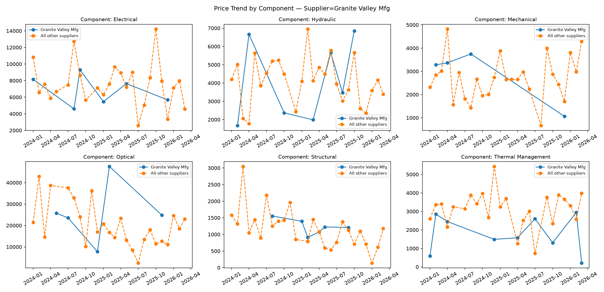
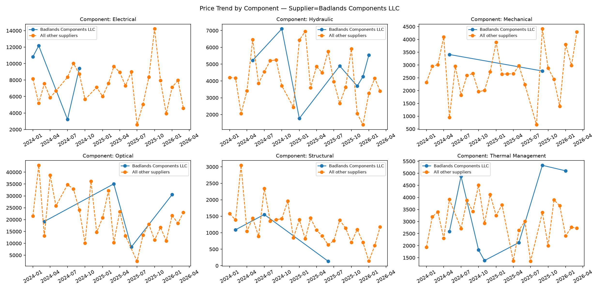
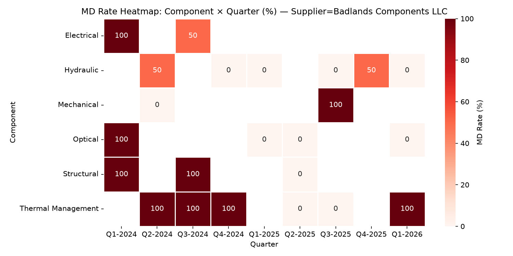
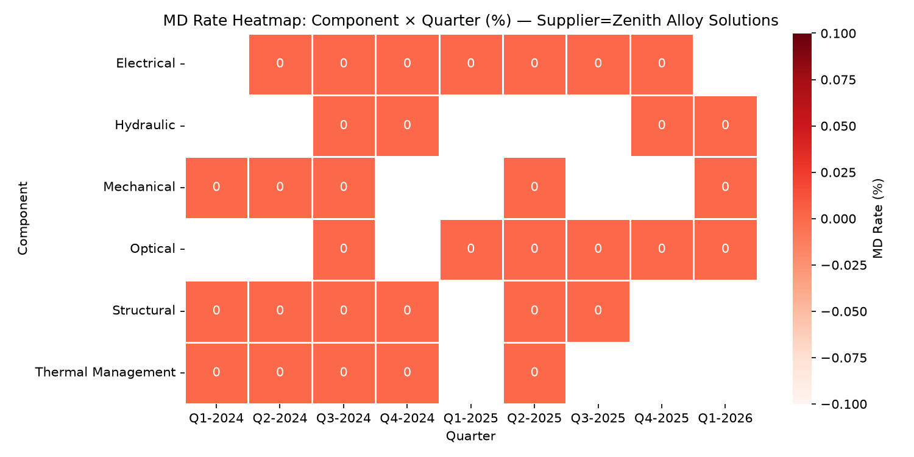

# Report 3 — Renewal Season: Negotiating Position for Top 5 Suppliers

**Dataset:** `supplier-stability-dataset.csv` (517 orders, 44 suppliers, 6 component categories, 3 criticality tiers, 2024–2026)
**Output artifacts:** [`output_problem_3/`](./output_problem_3/)
**Tooling:** `procurement-analyzer` skill

---

## 1. Problem Statement

Renewal season is here. For each of the biggest suppliers by spend, build a data-backed negotiating position answering three questions:

1. **Are they priced fairly vs. peers?** — in each component category they serve, not just on average.
2. **Is that pricing gap widening or stable over time?** — a one-time snapshot isn't enough; the trajectory matters going into a renewal.
3. **Has their delivery/quality performance earned them anything better than "hold the line" on price?** — reliable, defect-free suppliers have leverage to ask for more volume in exchange for price relief; unreliable ones don't get to keep a premium.

**Scope:** the 5 largest suppliers by total spend across the whole dataset — together they represent **~41% of total procurement spend**:

| Rank | Supplier | Total Spend | % of Total Spend |
|---|---|---|---|
| 1 | Zenith Alloy Solutions | $7,832,669 | 13.29% |
| 2 | Badlands Components LLC | $5,316,408 | 9.02% |
| 3 | Ironclad Assemblies | $4,284,451 | 7.27% |
| 4 | Granite Valley Mfg | $3,816,437 | 6.48% |
| 5 | Dusk Manufacturing Co | $3,140,941 | 5.33% |

---

## 2. Scripts Executed and Why

| # | Script | Scope | Purpose |
|---|---|---|---|
| 1 | `supplier_summary.py` (op 8 — Supplier Summary) | `--supplier <name>`, run once per supplier (5x) | Fast orientation: headline OTD/defect/rework across the supplier's full portfolio, plus a per-category breakdown that already includes `price_index_vs_peers_pct` (spend-weighted price vs. category peers) and `is_dominant_supplier` — the primary input for "are they priced fairly." |
| 2 | `supplier_scorecard.py` (op 7 — Supplier Ranking and Scorecard) | `--supplier <name>`, run once per supplier (5x) | Finer-grained delivery/quality detail per category — `avg_days_late`, `md_rate_pct_supplier_error` (defects specifically attributed to supplier fault, not just any defect), `rework_cost_pct_of_spend` — used to validate the summary's headline numbers and isolate where problems are supplier-caused. |
| 3 | `supplier_price_trend.py` (op 11 — Supplier Price Trend vs. Peers) | `--supplier <name>`, no `--component` (whole portfolio, faceted by category), run once per supplier (5x) | Monthly supplier-vs-peer price series per category — the raw evidence for question 2 (widening/stable). Monthly granularity proved too sparse/noisy on this dataset (1–2 orders per supplier per month), so the monthly series was re-aggregated to **quarterly, spend-weighted** gaps for each supplier's largest category to get a readable trend (methodology detailed in Step 3). |
| 4 | `supplier_defect_heatmap.py` (op 12 — Supplier Defect Heatmap by Quarter) | `--supplier <name>` (no `--component` flag exists), run once per supplier (5x) | Whether quality problems are a one-time event or a chronic, recurring pattern — directly answers whether performance issues are the kind that should cost a supplier their pricing power at renewal. |

---

## 3. Step-by-Step Execution and Findings

### Step 1 — Supplier Summary (orientation + price-fairness baseline)

**Command pattern:**
```
uv run .claude/skills/procurement-analyzer/scripts/supplier_summary.py \
  --filepath datasets/supplier-dataset/supplier-stability-dataset.csv \
  --supplier "<name>" \
  --output datasets/supplier-dataset/output_problem_3/summary_<Supplier>.json
```

**Portfolio-wide headline (all 6 categories combined):**

| Supplier | Total Spend | POs | OTD % | Defect Rate | Total Rework Cost | Days Lost to Defects | Open-Late POs |
|---|---|---|---|---|---|---|---|
| Zenith Alloy Solutions | $7,832,669 | 45 | **100.00%** | **0.00%** | $0 | 0 | 0 |
| Badlands Components LLC | $5,316,408 | 31 | **22.58%** | **54.84%** | $68,236 | 237 | 3 |
| Ironclad Assemblies | $4,284,451 | 39 | **100.00%** | 5.13% | $0 | 33 | 0 |
| Granite Valley Mfg | $3,816,437 | 43 | 90.70% | 6.98% | $0 | 41 | 0 |
| Dusk Manufacturing Co | $3,140,941 | 39 | 71.79% | 15.38% | $35,640 | 78 | 2 |

**Priced fairly vs. peers? — per-category `price_index_vs_peers_pct`** (100% = at parity; >100% = premium; <100% = cheaper than category peers):

| Supplier | Electrical | Optical | Hydraulic | Mechanical | Structural | Thermal Mgmt |
|---|---|---|---|---|---|---|
| Zenith Alloy Solutions | **125.93%** (dominant, 25.6% share) | 143.53% | 74.83% | 152.31% | 91.28% | 128.20% |
| Badlands Components LLC | 116.33% | **149.23%** (top category) | 131.05% | 113.19% | 75.35% | 95.07% |
| Ironclad Assemblies | **87.81%** (top category) | 70.86% | 142.74% | 78.46% | 117.50% | 81.90% |
| Granite Valley Mfg | 83.18% | **97.11%** (top category) | 96.90% | 126.72% | 112.53% | 53.65% |
| Dusk Manufacturing Co | 86.38% | **76.16%** (top category) | 87.26% | 35.38% | 61.31% | 121.85% |

(Bold = the supplier's largest-spend category, used as the primary trend/negotiation focus in Steps 3–4.)

**Key findings:**
- **Zenith Alloy Solutions** is priced *above* peers in 4 of its 6 categories — including its largest and dominant position, Electrical, at a 25.9% premium — while delivering flawless performance everywhere.
- **Badlands Components LLC** charges a premium in 4 of 6 categories (including its largest, Optical, at +49.2%) despite the worst delivery/quality record in this group by a wide margin.
- **Ironclad Assemblies** and **Dusk Manufacturing Co** are net cost-competitive (cheaper in 4/6 categories each), but for very different reasons — Ironclad backs it with flawless delivery; Dusk's discount coexists with a 71.8% OTD rate.
- **Granite Valley Mfg** sits closest to true parity overall (Optical at 97.1%, Hydraulic at 96.9%), with good but not flawless delivery (90.7% OTD).

---

### Step 2 — Supplier Ranking and Scorecard (delivery/quality detail per category)

**Command pattern:**
```
uv run .claude/skills/procurement-analyzer/scripts/supplier_scorecard.py \
  --filepath datasets/supplier-dataset/supplier-stability-dataset.csv \
  --supplier "<name>" \
  --output datasets/supplier-dataset/output_problem_3/scorecard_<Supplier>.json
```

**Detail for each supplier's largest-spend category (used for the negotiating position):**

| Supplier | Top Category | Spend Share of Portfolio | Avg Unit Price | OTD % | Avg Days Late | Supplier-Fault Defect % | Rework % of Spend |
|---|---|---|---|---|---|---|---|
| Zenith Alloy Solutions | Electrical | 50.59% | $10,213.68 | 100.00% | 0.60 | 0.00% | 0.00% |
| Badlands Components LLC | Optical | 49.11% | $28,689.77 | 25.00% | 8.25 | 25.00% | 0.22% |
| Ironclad Assemblies | Electrical | 33.74% | $7,121.51 | 100.00% | 0.12 | 0.00% | 0.00% |
| Granite Valley Mfg | Optical | 45.49% | $18,668.81 | 100.00% | 1.17 | 0.00% | 0.00% |
| Dusk Manufacturing Co | Optical | 36.83% | $14,641.34 | 80.00% | 4.20 | 20.00% | 0.87% |

**Key findings:**
- Badlands' worst delivery number is in **Electrical**, not even its top category: 0% OTD, 23.60 average days late, 60% supplier-fault defect rate — this is its second-largest position (20.2% of its own portfolio) and it's badly mismanaged.
- Ironclad's near-zero `avg_days_late` (0.12 days in its top category) confirms the 100% OTD isn't a rounding artifact — genuinely on-time, essentially every time.
- Dusk's rework percentages, while individually small (0.6–7.0% by category), are non-zero in 5 of 6 categories — a pattern of small, recurring quality costs rather than one bad batch.

---

### Step 3 — Supplier Price Trend vs. Peers (is the pricing gap widening or stable?)

**Command pattern:**
```
uv run .claude/skills/procurement-analyzer/scripts/supplier_price_trend.py \
  --filepath datasets/supplier-dataset/supplier-stability-dataset.csv \
  --supplier "<name>" \
  --image-output datasets/supplier-dataset/output_problem_3/price_trend_<Supplier>.png \
  --json-output datasets/supplier-dataset/output_problem_3/price_trend_<Supplier>.json
```

**Methodology note:** the script's native output is a *monthly* average price series. On this dataset each supplier places only 1–2 orders per category per month, so month-over-month gaps are dominated by single-order noise rather than a real trend (e.g., raw monthly gaps for Zenith/Electrical ranged from -6% to +267% month to month). To get a readable trend, the underlying data was re-aggregated to **quarterly, spend-weighted average unit price** (target supplier vs. all other suppliers in the same category) for each supplier's largest category — the same weighting convention the skill's own scorecard uses elsewhere.

**Output (two representative cases):**




**Quarterly price gap vs. peers, target category (chronological):**

| Supplier (category) | Quarterly gap sequence | Verdict |
|---|---|---|
| Zenith Alloy Solutions (Electrical) | +38.7% → +57.5% → +124.2% → +70.2% → -6.4% → +267.3% → +4.3% | Persistent premium (positive in 6 of 7 quarters), magnitude highly volatile — **no confirmed narrowing**, treat the full-period average (+25.9%) as the negotiation baseline |
| Badlands Components LLC (Optical) | +32.8% → +135.3% → -43.8% → +54.3% | No consistent direction, only 4 data points spread across 2 years — **volatile, not a trend**; the performance failure is the dominant signal here, not pricing direction |
| Ironclad Assemblies (Electrical) | -69.9% → -13.3% → -6.5% → -36.9% → -27.6% → **+119.5%** | Cheaper than peers for 5 of 6 quarters (2024–2025), then a sharp reversal in the most recent quarter (Q1-2026) — **possible early price creep, single data point, needs verification before it's treated as the new baseline** |
| Granite Valley Mfg (Optical) | -43.3% → -17.1% → -49.5% \| +164.9% → +67.4% | Consistently cheaper through all of 2024, then consistently and substantially more expensive through 2025 — **the clearest widening trend of the 5 suppliers** |
| Dusk Manufacturing Co (Optical) | -69.6% → +23.8% → +117.4% | Rising trend across 3 sparse quarters — **directionally widening, but weak sample size** |

**Key findings:**
- Only one supplier — **Granite Valley Mfg** — shows an unambiguous, multi-quarter reversal from below-peer to above-peer pricing. This is the strongest "walk the price back" case in the group.
- **Zenith** and **Badlands** are both persistently priced above peers, but too volatile quarter-to-quarter to call a clean trend; the whole-period average premium is the more defensible number to negotiate against.
- **Ironclad** and **Dusk** both show a recent-quarter jump toward (or past) peer pricing after being cheaper for most of the observed history — worth flagging at renewal, but each rests on a single recent quarter and should be verified with the supplier rather than treated as confirmed.

---

### Step 4 — Supplier Defect Heatmap by Quarter (has performance earned anything better than hold-the-line?)

**Command pattern:**
```
uv run .claude/skills/procurement-analyzer/scripts/supplier_defect_heatmap.py \
  --filepath datasets/supplier-dataset/supplier-stability-dataset.csv \
  --supplier "<name>" \
  --image-output datasets/supplier-dataset/output_problem_3/defect_heatmap_<Supplier>.png \
  --json-output datasets/supplier-dataset/output_problem_3/defect_heatmap_<Supplier>.json
```

**Output (two representative cases):**




**Defect timing pattern (quarters with any recorded defect, chronological):**

| Supplier | Quarters with defects | Pattern |
|---|---|---|
| Zenith Alloy Solutions | *(none — zero defects recorded across the entire 2+ year history)* | Clean record, no exceptions |
| Badlands Components LLC | Q1-2024, Q2-2024, Q3-2024, Q4-2024, Q3-2025, Q4-2025, Q1-2026 — spread across 4 different categories | **Chronic** — defects recorded in nearly every quarter of the supplier's history, not a one-off incident |
| Ironclad Assemblies | Q1-2024 only (2 events, Hydraulic and Mechanical) | Isolated to the very start of the relationship; clean for the last ~2 years |
| Granite Valley Mfg | Q1-2024, Q1-2025, Q1-2026 (3 events, 3 different categories) | Sparse and scattered, no concentration |
| Dusk Manufacturing Co | Q2-2024, Q4-2024 (x2), Q1-2025, Q3-2025 — 4 different categories | Recurring across roughly two-thirds of the observed quarters |

**Key findings:**
- Zenith and Ironclad both back up their pricing (or lack of premium, in Ironclad's case) with genuinely earned performance records — Zenith's is flawless, Ironclad's had a rough start in Q1-2024 but has been clean for two years since.
- Badlands' problem isn't a bad quarter — it's nearly every quarter, across 4 of 6 categories. This forecloses any "temporary issue" argument at the negotiating table.
- Dusk's defects are less severe individually than Badlands' but still recur often enough (5 of ~9 quarters) to undercut any case for rewarding its below-peer pricing with more volume.

---

## 4. Result: Negotiating Position by Supplier

| Supplier | Priced Fairly? | Trend | Performance Earned? | **Recommended Negotiating Position** |
|---|---|---|---|---|
| **Zenith Alloy Solutions** (#1, 13.29%) | No — premium in 4/6 categories, including its dominant 25.9%-premium Electrical position | Persistent premium, not confirmed to be narrowing | **Yes** — flawless: 100% OTD, 0% defects, $0 rework | Performance has earned trust and continued/expanded volume — but not a blank check on price. Use the combination of scale (largest supplier, dominant 25.6% share of Electrical) and flawless delivery as leverage to negotiate the 4 premium categories toward parity in exchange for a volume commitment. Do not concede any further price increase. |
| **Badlands Components LLC** (#2, 9.02%) | No — premium in 4/6 categories despite being the worst performer in the group | Volatile, no stable direction | **No** — 22.6% OTD, 54.8% defect rate, $68K rework, defects recurring nearly every quarter for 2+ years | No grounds for anything but aggressive pushback. Demand price reductions **and** binding SLA terms (OTD floor, defect rate cap, rework chargebacks) as a condition of renewal. Treat this as a probationary/corrective-action renewal, not a standard one. |
| **Ironclad Assemblies** (#3, 7.27%) | Mostly — cheaper in 4/6 categories, but Hydraulic (+42.7%) and Structural (+17.5%) stand out, and Electrical spiked to +119.5% in the most recent quarter | Was narrowing/negative for 2 years; single most recent quarter reversed sharply | **Yes** — 100% OTD, near-zero defects (isolated to Q1-2024), $0 rework | A reliable, largely cost-competitive supplier that has earned continued/expanded volume. Negotiate down the Hydraulic and Structural premiums specifically, and get an explanation for the Q1-2026 Electrical price jump before it's allowed to become the new baseline. |
| **Granite Valley Mfg** (#4, 6.48%) | Close to parity overall, but its top category (Optical) swung from a discount to a real premium | **Clearest widening trend of the 5** — consistently cheaper through 2024, consistently pricier through 2025 | Mostly — 90.7% OTD, low defect rate, but not flawless | Performance hasn't improved to justify the price run-up. This is the strongest "roll back the recent increase" case in the group — push pricing in Optical back toward the 2024 baseline. |
| **Dusk Manufacturing Co** (#5, 5.33%) | Cheaper in 5/6 categories, but the discount coexists with real delivery/quality risk | Rising trend in its top category (Optical), on a thin sample | **No** — 71.8% OTD (below reliability threshold), 15.4% defect rate, $35.6K rework, defects recurring across ~5 of 9 quarters | The current discount reflects real risk, not a bargain worth protecting as-is. Hold the line hard: do not accept the rising-price trend without a demonstrated, sustained improvement in OTD and defect rate first — tie any price increase to a performance improvement plan. |

---

## 5. Conclusion

Across the 5 biggest suppliers (~41% of total spend), pricing and performance diverge in almost every direction: the best performer (Zenith) is also the most expensive relative to peers; the worst performer (Badlands) still charges a premium in most of its categories; and the clearest case for a straightforward price rollback (Granite Valley Mfg) is a mid-tier performer whose pricing outran its delivery record rather than tracked it. None of the 5 relationships is a clean "hold the line and move on" — each needs a distinct approach at the table:

- **Zenith Alloy Solutions** and **Ironclad Assemblies** have earned leverage through genuinely strong delivery records and should be rewarded with volume growth — but Zenith's case is "trade volume for price parity" given its across-the-board premium, while Ironclad's is "protect what's already working" with two specific premium outliers to fix.
- **Badlands Components LLC** and **Dusk Manufacturing Co** have not earned anything — their below-line or above-line pricing should be renegotiated from a position of strength, backed by chronic, quarter-over-quarter delivery/quality data that leaves no room for a "one bad batch" defense.
- **Granite Valley Mfg** is the one supplier where the pricing trend itself — not the performance record — is the primary issue, and the strongest, most defensible ask is simply: explain the 2025 price increase, or roll it back.

The common thread: a supplier's overall reputation ("Zenith is great," "Badlands is a problem") isn't precise enough for a renewal conversation. The category-level and quarter-level detail is what turns a general impression into a specific, defensible ask at the table.
